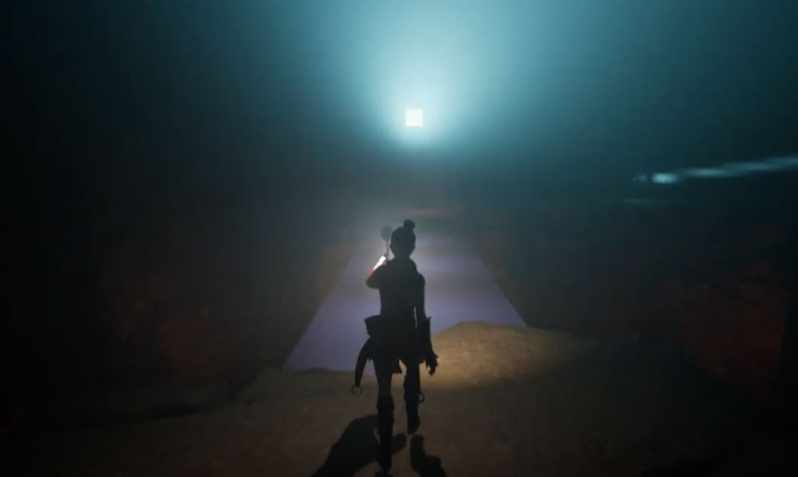
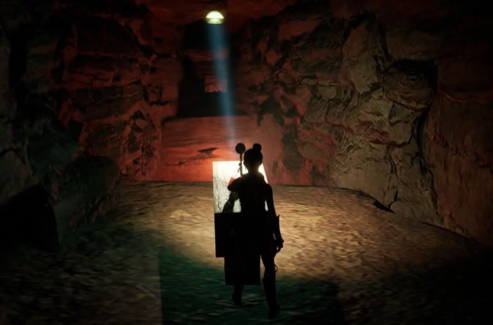

# chaseofshadows
Chase of Shadows

[DEMO VIDEO](https://drive.google.com/file/d/1Y23Olu2M5ArhwkLnJf2ieeK0cO1RLJOS/view?usp=sharing)

# Executive Summary
"Chase of Shadows" is a fast-paced adventure game where you, the player, have fallen into a network of underground caverns. Equipped with only a mystical Light Wand, you must navigate the labyrinth while evading shadow creatures attracted to light. The game combines elements of horror and adventure, utilizing light and darkness to prey on the fear of the unknown. As you try to reach the cave’s exit, you may pick up light resources along the way, using them sparingly to illuminate pathways without attracting enemies.

## GAME Design - CREATIVE
### High Concept
"Chase of Shadows" is a game where players must escape monsters and solve logical puzzles in a cavern environment. Using light magic, players can navigate the caves and and seek an escape.

### Design Goals
#### Main Design Features
- **Player goals and objectives:**
  - **Main goal:** Reach the exit door in each level.
  - **Secondary goals:**
    - Evade shadow enemies.
    - Use light to navigate the tunnel system.
- **Type of challenge(s):**
  - Utilize various types of lights and powerups to navigate dark corridors.
  - Balance use of light to advance without attracting enemies.
- **Type of conflict(s):**
  - Enemies actively diminish light and hinder the player's progress.
  - Possibility of enemy encounters and occasional combat.
- **Winning condition:**
  - Player wins a level by reaching the exit of the cave.

#### Main rules and procedures
- **Operational rules:**
  - Players begin at the start of a cavern system and navigate through it.
- **Main game mechanic:**
  - Players use WASD controls to move, with additional controls for interacting with objects and combat.
- **On a second by second basis:**
  - Players must consider direction, proximity to exit, and enemy presence.
- **On a minute by minute basis:**
  - Players must consider direction, available resources, and pathway illumination.
- **What makes this fun or interesting:**
  - Fear of darkness/unknown.
  - Enemies attracted to the player’s light.
  - Navigating a maze-like structure.

#### Player Resources
- **Types of resources:**
  - Light Wand (main resource).
  - Light grenade.
  - Stamina powerups.
  - Wall/cavern lights.
- **How resources are used to achieve goals:**
  - Resources primarily assist in finding an exit path, with limitations to avoid making the solution too obvious.

#### Boundaries and Constraints
- **Game environment:**
  - Players are confined to a cavern structure and must navigate allowed pathways.
  - Players must weigh the tradeoff between darkness and difficulty navigating or light and attracting enemies.
